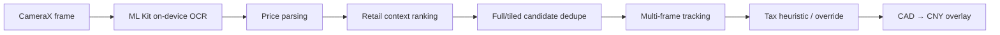

# CAD to CNY Camera

**Point an Android phone at a Canadian retail price tag and see a tax-aware RMB conversion directly on the camera preview.**

[](https://github.com/bettercallcaleb/cad-to-cny-camera/actions/workflows/android.yml)
[](LICENSE)


CAD to CNY Camera is a small, privacy-first Android computer-vision project built for a practical shopping problem: when a shelf label is in Canadian dollars, show the approximate Chinese-yuan cost without typing the price into a calculator.

It uses **CameraX** for the live preview, **ML Kit Text Recognition** for on-device OCR, retail-price heuristics to reject misleading numbers, and a small temporal tracker to keep overlays stable across frames.

<p align="center">
  
  
</p>

## What it does

- Detects CAD-looking retail prices from the live camera feed.
- Draws the converted **CNY price beside or over the detected shelf price**.
- Tracks multiple price tags at once and stabilizes detections across frames.
- Supports a manually configurable CAD→CNY exchange rate stored locally on the device.
- Offers Ontario tax modes: **Auto**, **0%**, and **13%** override.
- Includes full-frame + tiled OCR to improve recognition of small shelf labels.
- Supports tap-to-focus and pinch-to-zoom through CameraX.
- Keeps OCR local: the app requests camera access but removes Internet and network-state permissions from the merged manifest.
- Includes debug OCR / candidate overlays in debug builds for tuning heuristics.

## Why this is more than a currency converter

Retail labels contain many numbers that are *not* the final price: item numbers, unit prices, discount amounts, dates, percentages, bundle quantities, and “instant savings” values. The detector therefore ranks and filters OCR candidates instead of displaying the first decimal number it sees.

The current pipeline is:



Some of the implemented checks include split whole-dollar/cents reconstruction, three-decimal unit-price rejection, bundle-price parsing, shelf-label grouping, candidate scoring by text/geometry, duplicate suppression across OCR passes, and multi-frame stabilization.

## Privacy

The core OCR path is designed to run on-device. The Android manifest explicitly removes `INTERNET` and `ACCESS_NETWORK_STATE`; camera images are not intentionally uploaded or stored by the app. The exchange rate is entered manually and saved in local app preferences.

You can verify the permission model in [`AndroidManifest.xml`](app/src/main/AndroidManifest.xml).

## Tax behavior

The **Auto** tax mode uses a deliberately small text heuristic to classify a few common grocery terms as zero-rated or taxable. It is not a complete implementation of Canadian tax law and can be wrong when OCR misses the product description or a product falls outside the built-in vocabulary.

Use the **0%** or **13%** override when you know the applicable treatment. This project is a shopping utility / engineering experiment, not tax advice.

## Build from source

Requirements:

- Android Studio or Android SDK command-line tools
- JDK 17
- Android SDK 36

```bash
git clone https://github.com/bettercallcaleb/cad-to-cny-camera.git
cd cad-to-cny-camera
./gradlew testDebugUnitTest lintDebug assembleDebug
```

The debug APK will be written under:

```text
app/build/outputs/apk/debug/
```

Release signing is intentionally **not** stored in this repository. See [`local-signing.properties.example`](local-signing.properties.example) and keep the real keystore outside the repository.

## Project structure

```text
app/src/main/java/org/ramgpt/cad2cnycam/
├── MainActivity.kt          # CameraX, OCR scheduling, coordinate mapping, UI
├── RetailPriceDetector.kt   # Retail-specific candidate generation and ranking
├── PriceParser.kt           # Price parsing + lightweight tax classification
├── MultiPriceTracker.kt     # Multi-frame / multi-price stabilization
├── PriceOverlayView.kt      # CNY overlay rendering
├── DetectionStabilizer.kt   # Simple single-price temporal stabilizer
└── ScanOverlayView.kt       # Scan-region overlay
```

## Tests

Pure logic has local JVM tests for tax-term handling and price parsing. The GitHub Actions workflow also runs Android lint and assembles the debug APK.

## Known limitations

- OCR quality depends on lighting, motion blur, viewing angle, label size, and font.
- Retail heuristics were tuned around common Canadian shelf labels and are not retailer-complete.
- The exchange rate is manual by design; there is no live FX API because the app avoids network access.
- Automatic tax classification is intentionally conservative and incomplete.
- The app currently targets portrait phone use.

## Contributing

Bug reports and focused improvements are welcome. See [`CONTRIBUTING.md`](CONTRIBUTING.md) before opening a pull request.

## License

MIT © 2026 [bettercallcaleb](https://github.com/bettercallcaleb)
